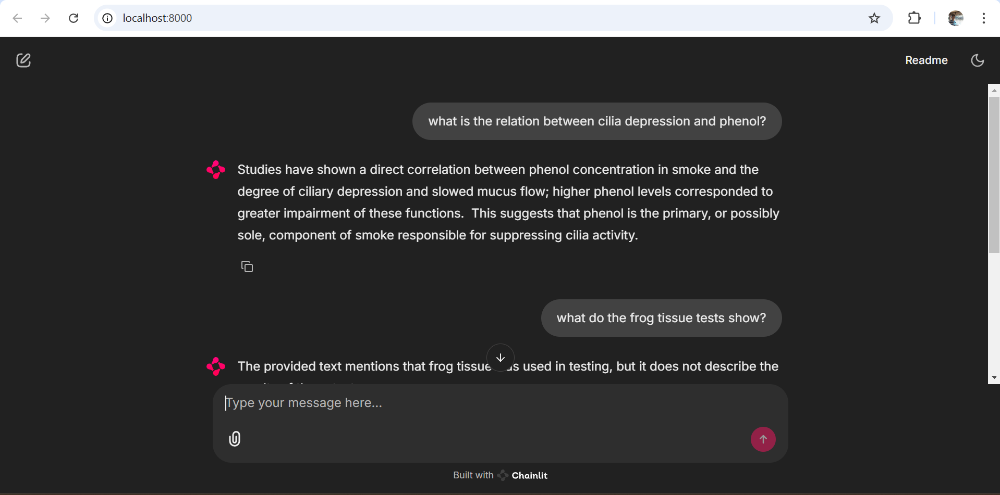

# RAG app using chainlit, chroma and google-genai

### Query your scanned document using RAG!

By: [Tanishq Selot](https://github.com/tanishq150802)  

Create a virtual environment and run ```pip install -r requirements.txt``` to set it up. Mention your google genai API key in the ```.env``` files and refer the steps below to get 
started.

Demo App built using chainlit:



## Approach
Refer to ```Report.docx```.

## Steps
Refer to ```query_sql_db``` folder for the SQL DB & API part of Task 2. 
* ```creating_db.py``` and ```insert_into_db.py``` are used for setting up the SQL DB. Already created as ```sql_db.db```.
* ```model.py``` is used for querying the SQL DB using the LLM.
* ```api.py``` contains the FastAPI setup.

Look up ```query_vector_db``` folder for the vector DB (chroma) & chainlit part of Task 2 and 3. 
* ```db_insertion_and_query.py``` is used for setting up the vector DB. Already created in the ```chromadb_store``` folder.
* ```classes.py``` contains all the helping classes.
* ```chainlit_app.py``` contains the chainlit chatbot setup. Use ```chainlit run chainlit_app.py -w``` for running the chatbot.

Refer to ```query_vector_db_milvus``` folder for milvus counterpart of the above case.

## Requirements
Refer to ```requirements.txt``` file. You can choose between OpenAI and Google genai based on the API
key you posses.

## References
* [chainlit](https://docs.chainlit.io/concepts/message)
* [chromadb docs](https://docs.trychroma.com/docs/overview/introduction)
* [Visual C++ build tools for chromadb installation](https://visualstudio.microsoft.com/visual-cpp-build-tools/)
* [Easy chroma integration with langchain](https://python.langchain.com/docs/integrations/vectorstores/chroma/)
* [Milvus vector DB](https://github.com/milvus-io/milvus) 
* [Google embeddings](https://cloud.google.com/vertex-ai/generative-ai/docs/model-reference/text-embeddings-api)
* [Gemini](https://ai.google.dev/api/generate-content)
* [Tesseract](https://github.com/h/pytesseract)
* [Cropping before OCR](https://medium.com/analytics-vidhya/opencv-basic-and-useful-tools-cropping-python-7ea671f7baf9)
* [OCR preprocessing](https://nextgeninvent.com/blogs/7-steps-of-image-pre-processing-to-improve-ocr-using-python-2/)